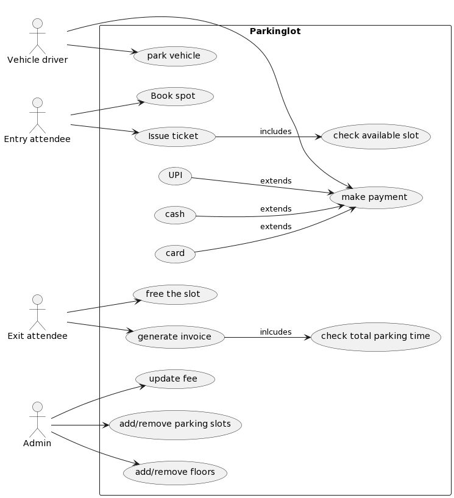

<<<<<<< HEAD
**Requirement:**

Current Scope:

    1. Size of the board? - 3X3
    2. How many players? - 2
    3. Type of players? - Human, Computer
    4. Symbols? - O and X

Future Scope:

    1. Can size may change in future? - Yes(nxn)
    2. Can multiple players play in future? - Yes(p)

Problem Statement:
* Board can be of any NxN size.
* There can be two players.
* Each player will be allotted a symbol.
* The symbol can be one of O and X.
* The players can be of type either human or bot.
* Each human player will have a name, email and profile image.
* Each bot player will have a difficulty level.
* Any random player can start the game.
* Then the players will take turns to play alternatively.
* The player with any consecutive N symbols in a row, column or diagonal wins. (check Winner)
* If the board is full and no player has won, the game is a draw.

Entities:
* Board
* Player
* Symbol
* Game

Attributes:
* Board Size
* No of Players
* Type of player
* Player symbol
* Player Name, email and image
* Difficulty Level

Behaviour:
* Choose Symbol
* Choose Player
* Select Difficulty
* Start Game
* Player turn
* Check winning condition
* Check draw condition

=======
Requirement
1. Can have multiple floors
2. multiple entry and exit gates
3. user can collect ticket at entry and pay at exit.
4. multiple vehicle types(large, medium, small)
5. Display board for available slots
6. Payment modes (cash, card, UPI)
7. per hr payment -> base fee + per hr charge
8. A car can be park on its slot not on other
9. Display board on each floor with the status of that floor

Build an online parking lot management system that can support the following requirements:

1. Should have multiple floors.
2. Multiple entries and exit points.
3. A user has to collect a ticket at entry and pay at or before exit.
4. Pay at:Exit counter (Cash to the parking attendant)
5. Dedicated automated booth on each floor - Payment counter Online
6. Payment via type:
   Cash
   Credit Card
   UPI
7. Allow entry for a vehicle if a spot is available for it.
8. Show on the display board at entry if a spot is not available.
9. Parking Spots of 3 types:
   Large
   Medium
   Small
10. A car can only be parked at its spot. Not on any other (even larger).
11. A display on each floor with the status of that floor.
12. Fees calculated based on per hour price: e.g. 50 rs for the first hour, then 80 rs per extra hour. invoice
    Small - 50, 80
    Medium - 80, 100
    Large - 100, 120

UML Diagram:

    @startuml
    left to right direction
    actor "Entry attendee" as EA
    actor "Exit attendee" as EX
    actor "Vehicle driver" as VD
    actor "Admin" as ADM
    rectangle Parkinglot{
    usecase "Issue ticket" as IT
    usecase "check available slot" as CA
    usecase "Book spot" as BS
    usecase "park vehicle" as PV
    usecase "make payment" as MP
    usecase "cash" as C
    usecase "card" as CC
    usecase "UPI" as UPI
    usecase "check total parking time" as PT
    usecase "generate invoice" as GI
    usecase "free the slot" as FS
    usecase "add/remove parking slots" as APS
    usecase "add/remove floors" as AF
    usecase "update fee" as UF
    }
    EA-->IT
    IT-->CA: includes
    EA-->BS
    VD-->PV
    VD-->MP
    C-->MP:extends
    CC-->MP:extends
    UPI-->MP:extends
    EX-->GI
    GI-->PT:inlcudes
    EX-->FS
    ADM-->APS
    ADM-->AF
    ADM-->UF
    @enduml

API:

    GET api/parkinglot/makePayment
    PUT api/parkinglot/updateslotstatus/{slotid}/{status}
    POST api/parkinglot/issueticket/{vehicleType}
    POST api/parkinglot/generateInvoice/{ticketId}
    PUT api/parkinglot/updateFee/{vehicleType}/{fee}
    POST api/parkinglot/addSlot/{floorid}/{vehicleType}
    DELETE api/parkinglot/deleteSlot/{slotid}
    POST api/parkinglot/addFloor
    DELETE api/parkinglot/deleteFloor/{floorId}

